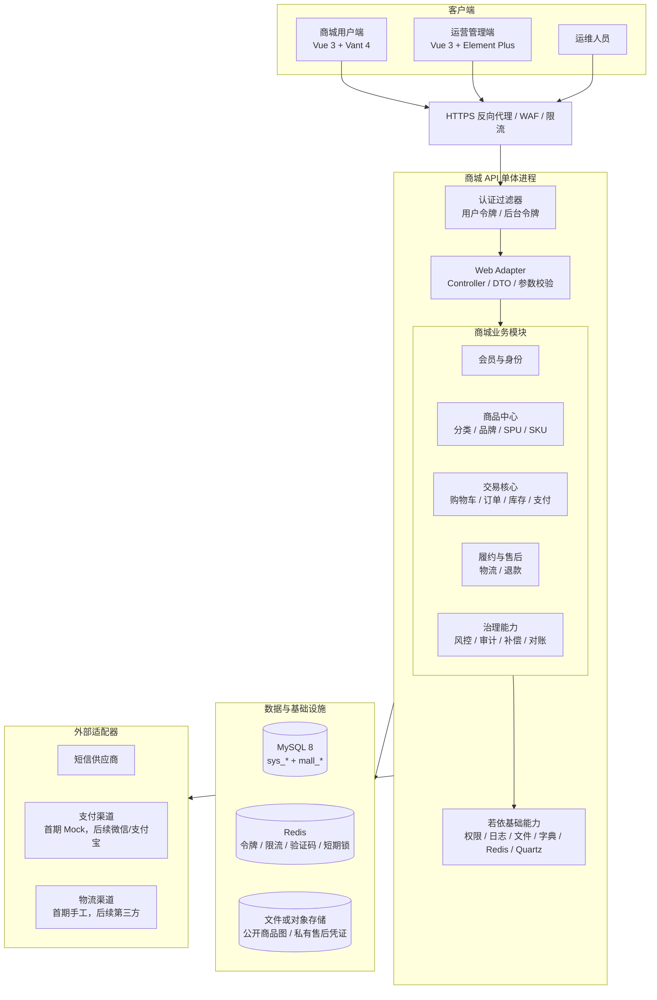
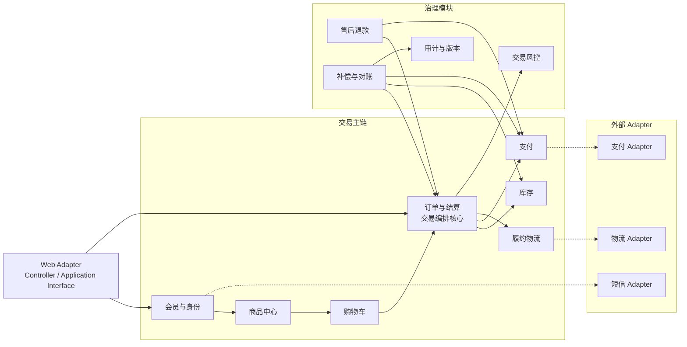
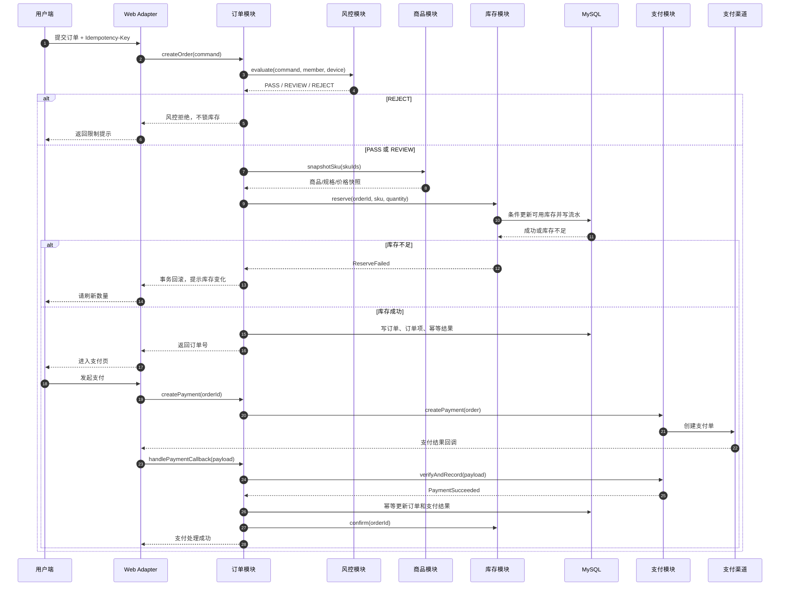
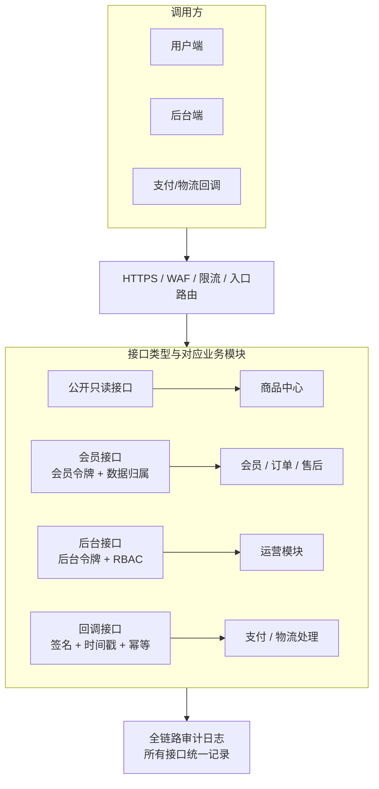
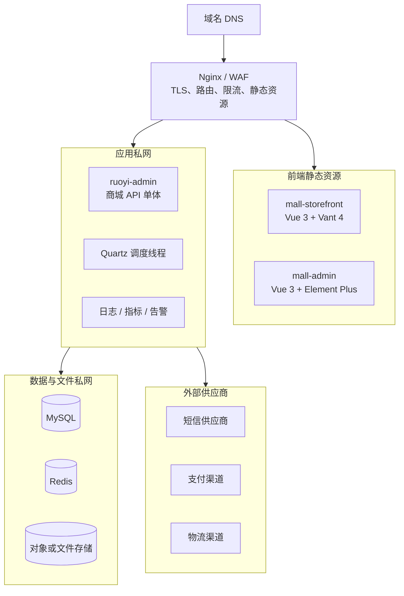

# 商城系统架构设计说明书

> 文档版本：V0.2  
> 对应需求：[商城系统需求分析说明书](./商城系统-需求分析说明书.md)  
> 编写日期：2026-07-22  
> 架构形态：模块化单体（Modular Monolith）

## 1. 架构结论

首期商城采用“模块化单体 + 分层架构 + 端口/适配器”的方案：

- 保留若依现有 Spring Boot 单体进程、MySQL、Redis 和 Quartz；前端升级为独立 Vue 3 用户端与 Vue 3 管理后台。
- 商城作为独立业务上下文，使用 `com.ruoyi.mall` 包和 `mall_` 表前缀，不与钢琴、票务、知识库练习模块共享业务表。
- 业务模块在同一进程内运行，订单、库存、支付状态变化可以使用本地事务；短信、支付、物流等外部能力通过接口和 Adapter 隔离。
- 首期不拆微服务，不引入服务注册、分布式事务和消息中间件集群；当单体模块确实需要独立伸缩时再拆分。

选择原因：当前项目已经是若依单体结构，商城首期的难点是交易规则、库存一致性、风控和权限，而不是服务数量。模块化单体能保持深模块和清晰 seam，同时降低部署与排错成本。

## 2. 技术基线

| 层次 | 方案 | 现有基础 |
| --- | --- | --- |
| 用户端 | Vue 3 + Vite + Pinia + Vue Router 4 + Vant 4 | 新建 `mall-storefront`，移动端优先的响应式 H5 |
| 运营端 | Vue 3 + Vite + Pinia + Vue Router 4 + Element Plus | 新建 `mall-admin`，复用若依后端认证、菜单和权限接口 |
| API 端 | Spring Boot 4、Java 17、Spring Security、JWT | `ruoyi-admin`、`ruoyi-framework` |
| 业务实现 | MyBatis、PageHelper、Bean Validation | `ruoyi-system` |
| 主数据库 | MySQL 8，商城表统一 `mall_` 前缀 | 现有数据源配置 |
| 缓存与短期状态 | Redis | 现有 RedisCache 和 TokenService |
| 定时任务 | Quartz | `ruoyi-quartz` |
| 文件存储 | 首期本地文件或兼容对象存储 Adapter | 现有 `/profile` 文件能力需重新划分公开/私有资源 |
| 反向代理 | Nginx 或同类网关，负责 TLS、限流、静态资源和路由 | 部署环境提供 |
| 版本发布 | Git 标签、不可变构建产物、发布/回滚脚本 | 开发启动前建立 |

## 3. 总体逻辑架构



### 3.1 入口边界

- 用户端域名只访问商城公开和会员接口，例如商品浏览、购物车、订单和售后。
- 后台域名只访问管理接口，使用独立后台身份、RBAC 和高风险操作二次确认。
- 外部支付/物流回调只进入专用回调接口，必须验签、校验时间戳、随机数和幂等键。
- MySQL、Redis、文件存储管理端口和 Druid 不进入公网入口。

## 4. 分层结构

每个商城业务模块采用相同的四层结构，但模块内部的 Mapper、表和领域规则不能被其他模块直接穿透访问。

```text
Controller / Web Adapter
        |
Application Interface（用例接口）
        |
Domain Implementation（状态、规则、事务编排）
        |
Repository / Port Interface
        |
MyBatis、Redis、外部供应商 Adapter
```

### 4.1 层职责

| 层 | 责任 | 不允许做的事 |
| --- | --- | --- |
| Web Adapter | 路由、认证上下文、DTO 转换、输入校验、统一响应 | 不编写库存、金额、订单状态规则 |
| Application | 编排一个完整用例，定义事务边界和权限前置条件 | 不暴露数据库对象给前端 |
| Domain | 订单状态机、金额计算、库存规则、风控判断、售后规则 | 不依赖 HTTP、Spring Request 或前端组件 |
| Port | 定义仓储、支付、短信、物流、文件等接口 | 不把第三方 SDK 类型泄露到业务核心 |
| Adapter | 实现 MyBatis、Redis、Mock、真实供应商和文件存储 | 不承载跨模块业务决策 |

## 5. 业务模块划分

### 5.1 会员与身份模块

**外部 Interface**：`MemberModule`，提供认证、资料、地址、授权同意和注销用例；短信供应商是模块内部的 `SmsProviderPort` seam。

**负责**：手机号验证码注册登录、密码登录、协议同意、会员资料、地址、账号注销、用户端令牌。

**边界**：会员身份是订单和购物车的所有权来源；其他模块只能通过 `MemberIdentity` 获取当前会员，不直接读取登录上下文实现。

### 5.2 商品中心模块

**外部 Interface**：`CatalogModule`，提供目录查询、商品维护、SKU 可售性和下单快照用例。

**负责**：分类、品牌、SPU、SKU、规格、商品图片、详情、上下架、搜索和商品快照。

**边界**：商品中心提供“当前可售 SKU”和“下单快照”接口；订单不能直接查询商品 Mapper，也不能在订单中引用会变化的商品价格。

### 5.3 购物车模块

**外部 Interface**：`CartModule`，提供购物车查询与变更用例。

**负责**：加购、改数量、勾选、删除、失效标记、合计预览。

**边界**：购物车不占库存；进入结算和提交订单时必须再次调用商品与库存接口校验。

### 5.4 订单与结算模块

**外部 Interface**：`OrderModule`，提供结算预览、订单命令和订单查询用例。

**负责**：结算预览、订单创建、订单状态机、订单快照、取消、超时关闭、确认收货和订单查询。

**边界**：订单模块是交易编排者，拥有订单状态和订单快照；它通过 `InventoryPort`、`PaymentPort`、`RiskPolicy` 调用其他模块，不直接操作这些模块的表。

### 5.5 库存模块

**外部 Interface**：`InventoryModule`。

**负责**：可用库存、锁定库存、销售扣减、释放、人工调整、库存流水和低库存预警。

**接口不变量**：

- `reserve(orderId, skuId, quantity)` 只能成功一次，不能产生负库存。
- `release(orderId)` 只能释放该订单仍处于锁定状态的库存。
- `confirm(orderId)` 只能把已支付订单的锁定库存转为销售扣减。
- 所有变更都必须产生来源明确的库存流水。

### 5.6 支付模块

**外部 Interface**：`PaymentModule`，提供创建支付、验证支付结果、记录支付和请求退款用例；支付渠道是模块内部的 `PaymentGatewayPort` seam。

**负责**：支付单、支付状态、Mock 支付、真实支付 Adapter、回调验签、重复回调和支付对账。订单模块负责支付回调这一完整用例的事务编排，支付模块返回经过验证的支付结果，不反向调用订单实现。

**边界**：支付模块核心只依赖内部 `PaymentGatewayPort`；首期 `MockPaymentAdapter` 和测试 Fake 满足该 Port，后续再加入微信/支付宝 Adapter。

### 5.7 履约物流模块

**外部 Interface**：`FulfillmentModule`，提供发货、物流查询和确认收货用例；物流供应商是模块内部的 `LogisticsProviderPort` seam。

**负责**：待发货、发货、物流单、物流节点、确认收货和自动收货。

**边界**：首期使用 `ManualLogisticsAdapter`；第三方物流只替换 Adapter，不改变订单和物流领域规则。

### 5.8 售后退款模块

**外部 Interface**：`AfterSaleModule`，提供售后申请、查询、审核、退货确认和退款编排用例。

**负责**：仅退款、退货退款、审核、拒绝、收货确认、退款和售后状态。

**边界**：售后以订单项为单位，累计退款不能超过实付金额；退款不直接修改支付原始记录。

### 5.9 风控模块

**外部 Interface**：`RiskModule`，提供下单风险决策和人工审核用例。

**负责**：待付款订单上限、频率限制、恶意占库存识别、风险信号、人工审核、风险名单和有效销量过滤。

**边界**：风控只输出风险决策和原因，不拥有订单状态；订单决定如何根据风控结果进入正常支付、待审核或拒绝。

### 5.10 审计、版本与任务模块

本节包含三个独立模块：`AuditModule` 记录操作人、角色、目标、前后摘要、请求追踪号和结果；`BusinessVersionModule` 为商品、分类、轮播和普通配置保存快照；`TaskModule` 处理超时订单、支付/退款对账、库存差异、失败重试和告警。

每个模块只暴露一个外部 Interface；具体仓储、调度器和告警发送方式留在内部 seam。业务版本恢复产生新版本，不覆盖历史记录。

## 6. 模块依赖与接口图



### 6.1 依赖规则

1. Controller 只能调用 Application Interface，不能调用 Mapper。
2. 一个模块只能写自己的表；跨模块读取通过接口或只读查询对象完成。
3. 订单可以编排库存、风控和支付，但库存不能反向调用订单实现业务流程。
4. 外部供应商 SDK 只能出现在 Adapter 包中，核心模块依赖 Port。
5. 共享模块只放通用能力，不放商城业务状态和规则。
6. 任何跨模块依赖必须有明确接口和测试 Fake，避免在测试中启动整套外部环境。

## 7. 交易链路设计

### 7.1 下单与支付时序



### 7.2 事务边界

| 用例 | 本地事务内容 | 外部补偿 |
| --- | --- | --- |
| 创建订单 | 风控结果、订单、订单项、库存锁定、库存流水、幂等结果 | 失败全部回滚 |
| 取消/超时关闭 | 订单状态、库存释放、库存流水 | 释放失败进入补偿任务 |
| 支付回调 | 支付流水、订单状态、库存确认、销量统计 | 回调失败重试和对账 |
| 发货 | 物流单、订单状态、操作日志 | 第三方成功但本地失败时对账 |
| 退款 | 售后状态、退款请求记录 | 退款渠道结果异步确认，禁止重复退款 |

外部服务调用不包在数据库事务中。事务提交后写入 Outbox/补偿任务，任务执行具有幂等键、最大重试次数和退避策略。

## 8. 数据架构

### 8.1 表按模块归属

| 模块 | 主要表 |
| --- | --- |
| 会员 | `mall_member`、`mall_member_consent`、`mall_member_address`、`mall_sms_code` |
| 商品 | `mall_category`、`mall_brand`、`mall_spu`、`mall_sku`、`mall_spec`、`mall_spec_value`、`mall_product_media` |
| 购物车 | `mall_cart_item` |
| 订单 | `mall_order`、`mall_order_item`、`mall_order_status_log`、`mall_payment` |
| 库存 | `mall_stock`、`mall_stock_log` |
| 履约 | `mall_shipment`、`mall_logistics_event` |
| 售后 | `mall_aftersale`、`mall_refund` |
| 风控 | `mall_risk_record`、`mall_risk_rule`、`mall_risk_list` |
| 审计与任务 | `mall_audit_log`、`mall_business_version`、`mall_outbox_event`、`mall_compensation_task`、`mall_reconciliation_diff` |
| 若依基础 | `sys_user`、`sys_role`、`sys_menu`、`sys_oper_log`、字典和参数表 |

### 8.2 关键数据不变量

- `mall_order_item` 保存商品名称、SKU 编码、规格文本、图片、单价和优惠后的快照。
- `mall_stock.available_quantity >= 0`，`locked_quantity >= 0`，库存变化必须有流水。
- `mall_payment.payment_no`、`mall_order.order_no`、`mall_aftersale.after_sale_no` 全局唯一。
- `mall_order` 的订单状态、支付状态、风险状态、售后状态分别保存。
- `mall_cart_item` 不参与库存锁定，结算时必须重新读取商品和库存。
- 审计日志、支付流水、库存流水和退款流水只追加，不允许普通业务删除或覆盖。

### 8.3 读写模型

首期使用同一 MySQL 读写模型，通过索引、分页和缓存优化查询；不提前引入 CQRS。工作台统计和有效销量可通过定时汇总或按状态聚合实现，后续数据量增长再拆读模型。

## 9. 安全架构



安全底线：API 路径被看到不是漏洞；未认证、越权、批量请求、伪造回调、管理端点暴露和敏感数据泄露才是必须阻断的风险。具体规则以需求文档的 `FR-SEC-001` 至 `FR-SEC-018` 为准。

## 10. 部署架构



### 10.1 部署边界

- Nginx 是唯一公网入口；API、MySQL、Redis、Druid 和文件管理接口只在私网可访问。
- 用户端和后台可使用不同域名，后台域名可再增加 VPN、IP 白名单或二次认证。
- 开发、测试、生产使用独立数据库、Redis、短信配置、支付配置和令牌密钥。
- 发布前保存代码版本、数据库迁移版本、应用配置摘要和构建产物；回滚只回退应用产物，默认不覆盖新交易数据。

## 11. 代码组织建议

首期沿用当前 Maven 多模块，不新增微服务；商城代码按以下 seam 组织：

```text
ruoyi-admin/
  src/main/java/com/ruoyi/web/controller/mall/
    member/ catalog/ cart/ order/ payment/
    fulfillment/ aftersale/ risk/ content/ audit/

ruoyi-system/
  src/main/java/com/ruoyi/mall/
    member/
      application/ domain/ port/ adapter/ mapper/
    catalog/
    cart/
    order/
    inventory/
    payment/
    fulfillment/
    aftersale/
    risk/
    content/
    audit/
    job/
  src/main/resources/mapper/mall/

mall-storefront/
  src/api/
  src/stores/
  src/views/
  src/components/

mall-admin/
  src/api/mall/
  src/stores/
  src/views/mall/
  src/components/

ruoyi-ui/
  仅作为现有 Vue 2 若依功能迁移参考，不进入商城生产构建

sql/
  V2.0.0__create_mall_core.sql
  V2.0.1__create_mall_risk_audit.sql

scripts/
  release.ps1
  rollback.ps1
```

说明：`ruoyi-system` 是现有业务实现模块，商城用独立 `com.ruoyi.mall` 包和 Mapper 路径隔离；当商城规模需要独立发布时，再将该包提取为 `ruoyi-mall` Maven 模块。

## 12. 深模块与测试策略

### 12.1 外部 Adapter

以下 seam 有真实的两个 Adapter，属于值得保留的模块接口：

| Seam | 测试 Adapter | 生产 Adapter |
| --- | --- | --- |
| `SmsProviderPort` | `FakeSmsAdapter` | `ProviderSmsAdapter` |
| `PaymentGatewayPort` | `FakePaymentAdapter` | `WechatPaymentAdapter` / `AlipayPaymentAdapter` |
| `LogisticsProviderPort` | `FakeLogisticsAdapter` | `ManualLogisticsAdapter` / 第三方 Adapter |
| `FileStoragePort` | `InMemoryFileAdapter` | `LocalFileAdapter` / Object Storage Adapter |

业务模块只依赖 Port；测试通过 Adapter 模拟成功、失败、超时、重复回调和供应商异常，不启动真实外部服务。

### 12.2 必测用例

- 同一幂等键连续提交十次只创建一笔订单。
- 两个并发请求争抢最后一件 SKU 只有一个成功。
- 订单创建中途异常时订单、订单项和锁定库存全部回滚。
- 未支付订单关闭后库存释放一次，重复关闭不重复释放。
- 支付回调重复到达不重复扣库存或变更金额。
- 会员无法读取和操作其他会员订单、地址、售后。
- 风险订单审核前不能发货，拒绝后正确关闭或退款。
- 外部支付成功但本地处理失败时可重试和对账恢复。
- 公开接口限流，Swagger/Druid/调试接口在生产不可访问。

## 13. 分阶段实施顺序

### 阶段 0：工程基线

建立 Git 仓库、基线标签、分支约定、发布脚本、回滚脚本、环境配置模板和数据库迁移目录；搭建 `mall-storefront` 与 `mall-admin` 两个 Vue 3 + Vite 工程，并先修复当前安全阻断项。

### 阶段 1：交易最小闭环

会员验证码登录（开发 Mock）、分类/品牌、SPU/SKU、库存、购物车、结算、订单、Mock 支付、后台订单和基础操作日志。

### 阶段 2：履约与风控

发货、物流节点、确认收货、售后退款、库存补偿、订单超时任务、重复下单防护、基础风控和风险审核。

### 阶段 3：运营与合规完善

轮播和推荐位、业务版本恢复、短信生产 Adapter、隐私授权与注销、审计查询、对账告警、接口安全测试。

### 阶段 4：增强能力

真实支付、第三方物流、优惠券、收藏、评价、经营分析；根据流量和团队规模评估是否拆分独立服务。

## 14. 架构决策与暂不做事项

| 决策 | 原因 |
| --- | --- |
| 模块化单体而非微服务 | 交易强一致、部署简单、符合当前若依结构和学习阶段 |
| 订单作为交易编排模块 | 集中维护订单状态、快照和幂等，避免流程散落在多个 Controller |
| 购物车不锁库存 | 避免低意愿用户长期占用库存，只有订单创建时才锁定 |
| 外部服务通过 Port/Adapter | Mock、真实供应商可替换，核心规则可独立测试 |
| 首期 MySQL 单库 | 先保证事务和可追溯，暂不引入分库分表和 CQRS |
| 首期不做通用“日志回放回滚” | 交易数据必须经过业务反向流程，保护财务和库存一致性 |
| 用户端使用 Vue 3 + Vant 4 | Vant 面向移动端交互，适合商城 H5，避免用桌面后台组件适配手机 |
| 管理端使用 Vue 3 + Element Plus | 使用现代 Vue 3 生态，商城尚未编码，此时迁移成本低于完成后升级 |
| 不长期保留 Vue 2 管理端 | `ruoyi-ui` 只作迁移参考，避免双技术栈造成权限和页面重复维护 |

暂不做：多商户、微服务集群、消息中间件集群、复杂促销引擎、机器学习风控、实时物流大数据和分布式搜索。上述能力只有在 P0 闭环稳定且有实际容量需求后再引入。

## 15. 架构确认清单

进入第三步 HTML 静态模型前，需要确认：

1. 模块化单体方案是否接受。
2. 用户端与后台是否使用分域名和独立身份令牌。
3. 首期是否接受 Mock 短信、Mock 支付和手工物流 Adapter。
4. 订单、库存、支付、售后和风控模块边界是否按本文档执行。
5. 是否同意先完成 Git 基线与安全阻断项整改，再开始商城业务编码。

已确认的前端决策：用户端采用 Vue 3 + Vant 4，管理端采用 Vue 3 + Element Plus，构建工具统一使用 Vite，状态管理统一使用 Pinia。

## 16. 版本记录

| 版本 | 日期 | 变更 |
| --- | --- | --- |
| V0.1 | 2026-07-22 | 建立模块化单体、业务模块、交易链路、安全和部署架构初稿 |
| V0.2 | 2026-07-22 | 用户端升级为 Vue 3 + Vant 4，管理端升级为 Vue 3 + Element Plus；现有 Vue 2 后台改为迁移参考 |
